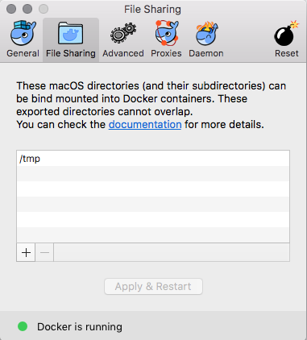

# D4M-NFS on Mac OSX

*Warning: Currently D4M-NFS is broken after the update to 17.12.0-ce-mac64. The issue can be followed here: https://github.com/IFSight/d4m-nfs/issues/55*

In order to speed up Docker instances on Mac OSX, D4M-NFS is a great solution that will increase file read/write performance up to 6X times.

### Steps for success!

1. Shut down any docker containers `docker stop $(docker ps -a -q)` otherwise you could get a "loop of death" which isn't fun from what I've read.
2. Quit the docker daemon/application.
3. Kill d4m if you have an old, non-working version running. You can determine this by running `screen -r d4m`
4. `cd ~/`
5. `git clone git@github.com:IFSight/d4m-nfs.git ~/d4m-nfs`
6. `cd ~/d4m-nfs/etc`
7. `touch d4m-nfs-mounts.txt`
8. Add the text `/Users/yourusername:/Users/yourusername:0:0`
    - Do not add /Volumes here, this should be the only thing added for this file.
9. Go into docker and remove everything else except /tmp.  

    - If you add other directories, this will not work as it will create conflicts with the NFS systems.
10. `cd ~/d4m-nfs`
11. `/bin/bash d4m-nfs.sh`
12. `sudo vim /etc/exports`
    - Remove any other non-commented lines except for `"/Users/yourusername" -alldirs -mapall=0:0 localhost`
    - If you see anything other than this you were not running with bash.
11. Start up ya dockers, rejoice!

#### Mount Points

I have not had success with adding code to a /mnt point and getting D4M-NFS to work. Please update the documentation if you have a solution.
