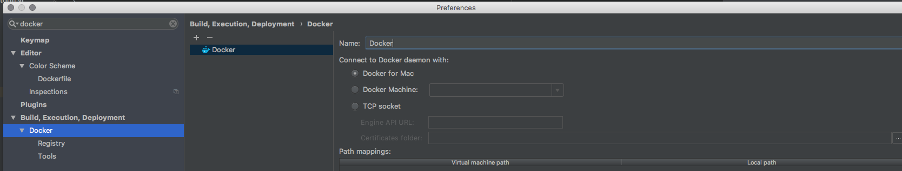
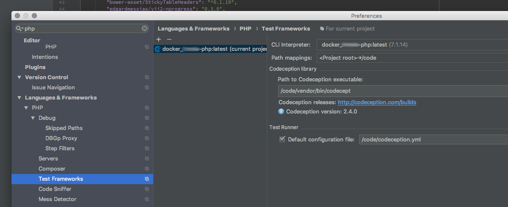
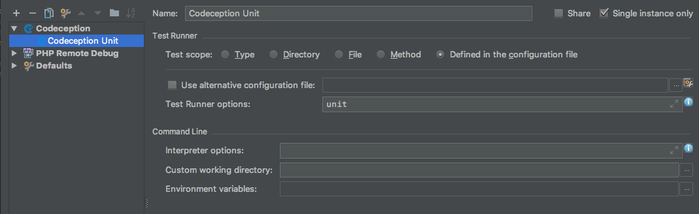
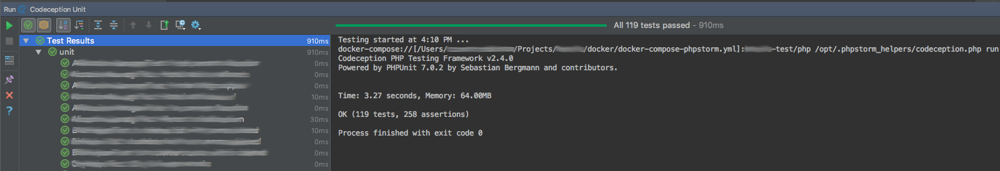

# PhpStorm & Docker

The goal for this tutorial is to help containerize an application to leverage the tools within PhpStorm (Test Suite,
Coverage, etc).

To do this the following things need to happen:

1) Setup Docker for Mac in PhpStorm.
2) Setup Language (PHP in this example) to use a remote interpreter.
3) Fix the paths to match our standard (/code for project code)
4) Setup Tests (PHPUnit or Codeception) to use a special docker-compose file.

We are assuming the following things:

1) Docker compose file exists for the project.
2) The project is already running via (docker-compose up --build)
3) Some small knowledge of Docker

## Setup Docker for Mac in PhpStorm

Head to Preferences and go to `Build, Execution, Deployment -> Docker`. Create an item called "Docker"
using the daemon option "Docker for Mac".



### Creating an isolated docker-compose for testing

In order for PhpStorm to run tests without affecting containers. You need to create a new container that matches
whatever container your code works on.

For example, here a random PHP project `docker-compose-phpstorm.yml` file.

```bash
version: '2'
services:
    project-test:
        container_name: sourcetoad_project_test
        build: .
        volumes:
            - ../:/code:delegated
        networks:
            - st-internal
```

As you can see, it is a subset of the compose file. It only includes a clone of the PHP container, keeping intact the
networks, mounts and env file. This allows the new container to have access to databases and files which may be needed
in the test suite. You can use multiple compose files if you need one for an acceptance test container.

If your project requires multiple containers in the testing aspect. Recommend creating descriptive container names,
like `project-codeception` so you could additionally have `project-behat` if needed.

### Setup Docker Container for PHP Language

Head to Preferences and go to `Languages & Frameworks > PHP`. From here we are going to click the "..." next to the CLI
Interpreter option in order to create a new "Docker Compose" interpreter. Using the file we created above, we will
select that one. Once selected, you need to select the container to use. This will more than likely be auto-selected for
you.


### Setup Docker Container for PHP Test Framework

Head to Preferences and go to `Languages & Framework > PHP > Test Frameworks`. Once here, click the "+" icon in top
right to create a new test environment. You will more than likely select one of the following:

* PHPUnit by Remote Interpreter
* Codeception by Remote Interpreter
* Behat by Remote Interpreter
* PHPSpec by Remote Interpreter

Once you select one, you will need to select the container to run this tool at. You already created the container and
loaded it in the previous steps. So just select the container that works. Once loaded, you need to put in the file path
to that binary. In the screenshot below, we are using Codeception so looking for `/code/vendor/bin/codecept`.
The `/code` is what we use to mount our code into the container. This pattern may be different depending on lots of
factors.

Finally, for this step you need to make sure you specify the configuration file for the test framework. The default
location may be wrong, in the photo below I gave the direct path to the configuration like: `/code/codeception.yml`.



### Setup Test Case to run in IDE

Head "Run -> Edit Configurations". Now you need to select the test framework that matches the test framework you
attached into the container. Since, we used Codeception, we will continue to use Codeception for this demo.

Our goal is to select the "Defined in the Configuration File". No matter the tool, if you configured it correctly, we
can just use those values and inherit.

This demo has made an additional change and requested Codeception to only run the "unit" test suite.



### Run the Test Suite

Now we should be able to the launch the test suite. Our docker-compose file will execute, spawning a new "test"
container based off our main language container.

This will then proceed to execute the test framework we specified, collecting the results and parsing them into the UI.

This can be shown below:



With that you have successfully hooked the test suites, while keeping Docker inside PhpStorm.
