# Pycharm Python Debugging with a containerized application

## Abstract

How to setup [PyCharm](https://www.jetbrains.com/pycharm/)'s remote python debugger for applications configured to run in a containerized architecture.

## Requirements

 - [Terminal](https://en.wikipedia.org/wiki/Command-line_interface#Command_prompt)
 - [Docker](https://www.docker.com/)
 - [Pycharm](https://www.jetbrains.com/pycharm/)
 - [Sourcetoad Data Sources](https://bitbucket.org/Sourcetoad/devop-tools)

## Setup

Overview:
Sourcetoad Data Source Services
PyCharm Project
PyCharm Remote Interpreter
PyCharm Remote Debugger

### Sourcetoad Data Sources
Start Sourcetoad Data Source services.
    `cd /{Sourcetoad data services root}`
    `docker-compose up --build -d`

### PyCharm Project:

 1) Open PyCharm  
 2) Click 'New Project'  
 3) Select 'Pure Python' as the type, then any interpreter. (Make sure Interpreter is on the host).  
 4) Click 'Yes' if the project already has files  
 5) Allow PyCharm to build and index the project  

### PyCharm Remote Interpreter

 1) Enter PyCharm `Preferences` Dialog  
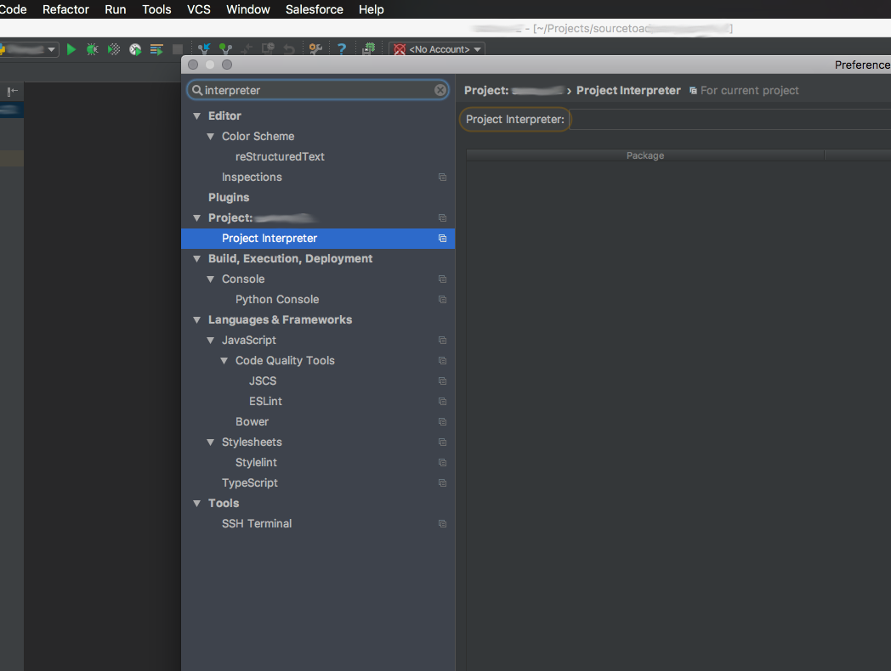

 2) Click the gear button on the very right of the `interpreter` field.  
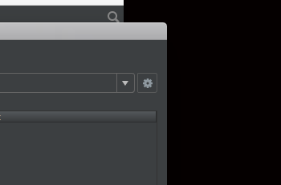

 3) Select 'Add Remote'  
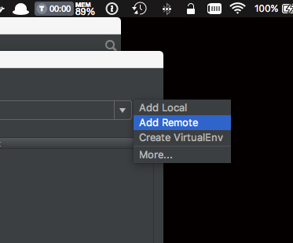

 4) Select 'Docker Compose'  
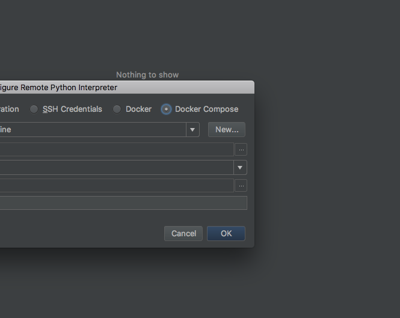

 5) Click the `...` icon to the right of the ''Configuration File(s)' file; populate with appropriate `docker-compose` files  
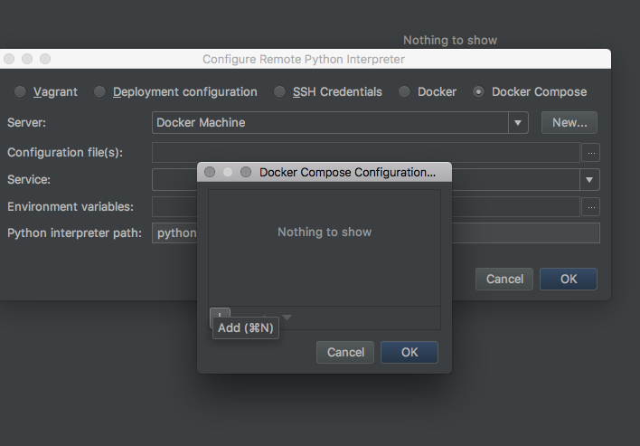

 6) Change 'Service' to the correct service desired  
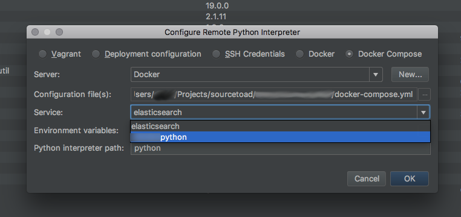

 7) IF virtual ENVs are used, populate 'Python Interpreter path' with appropriate path to the `venv` INSIDE the container
 - Exp: Some used `\pyvenv\bin\python`
 - NOTE: you may have to `docker-compose up --build` the environment first. In order for the image and python virtual ENV to exist  
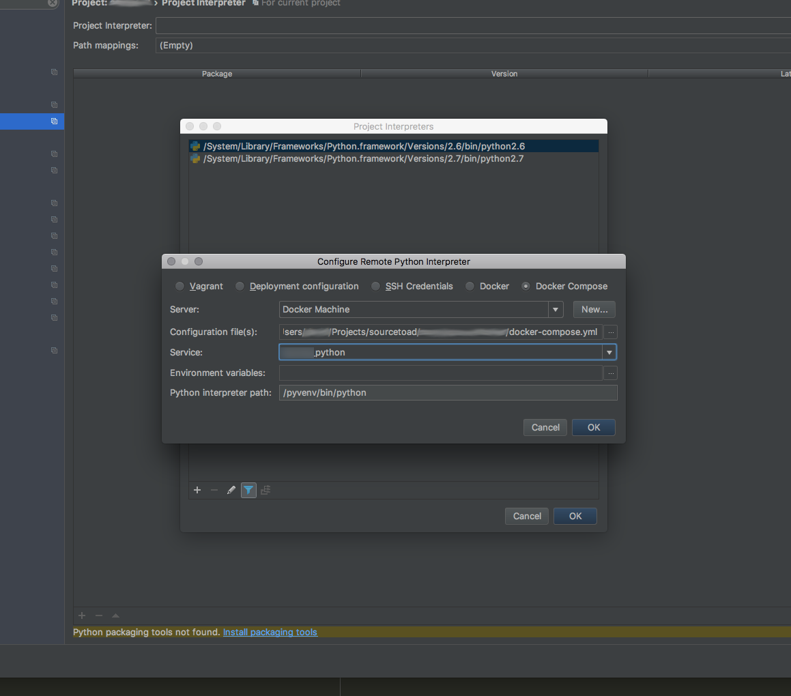
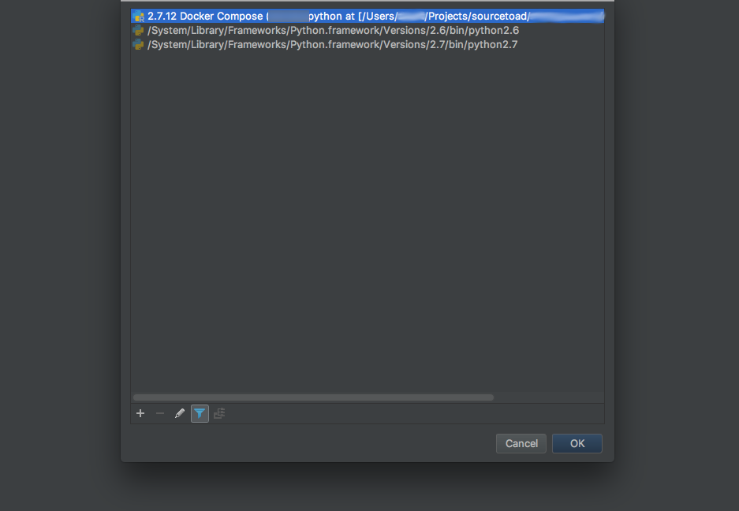

 8) Press the `ok` button and wait  
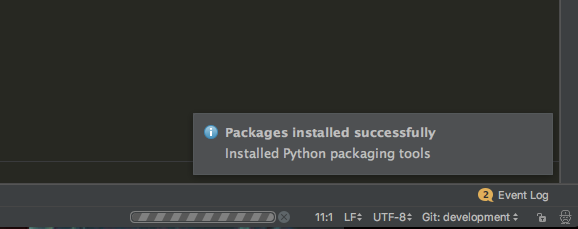

 9) the Python package list should eventually update with the list of all the packages listed in requirements.txt  
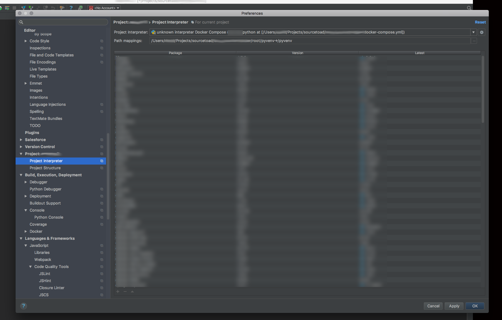

 10) Set path mapping. Host machines file path -> Inside container file path / venv if applicable.  
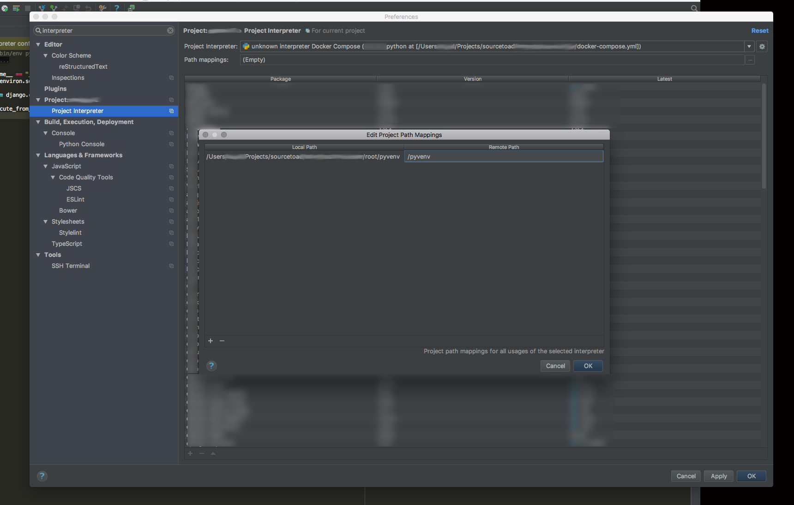

 11) Press 'Ok' in the bottom right and you're done.

 12) A 'docker compose run' dialog may appear, leave it alone and let it complete.

 13) Project indexing may appear, let it run as well.

### PyCharm Remote Debugger

 1) Enter Run/Debug Configurations  
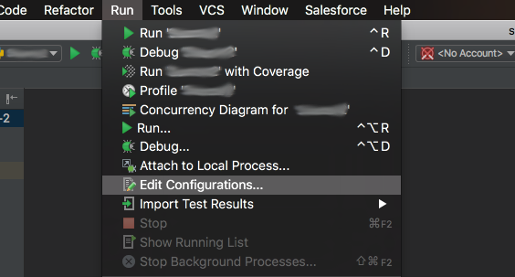

 2) OPTIONAL: Check 'Shared' to save the debugger configuration into the Projects .idea directory

 3) OPTIONAL: Check 'Single Instance' to prevent multiple debugging instances from being allowed

 4) Populate fields as desired
  - 'Scripts': Entry point of the application
  - 'Python Interpreter': Select the remote interpreter created in [PyCharm Remote Interpreter](./readme.md#PyCharm%20Remote%20Interpreter)
  - 'Working Directory': File path to the projects files  
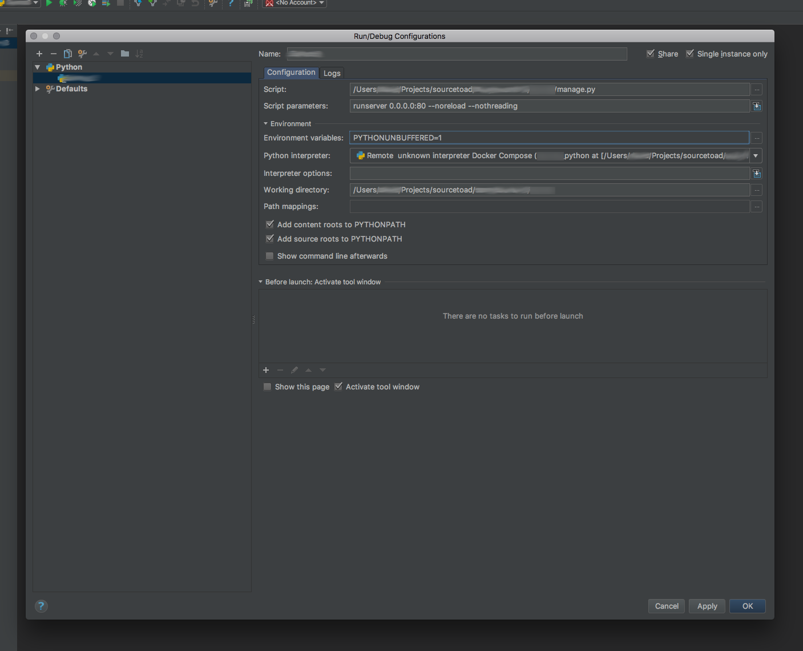

 5) Open the applications entry script file and set a break point.
 - If you get a warning that packages are missing, ignore it.

 6) Press the 'Debug' button
 - NOTE: If the editor indicates packages are missing, ignore it.  
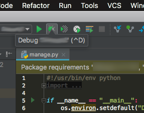

 7) Let Docker compose up do its thing

 8) Witness the debugger stopping at the break point  
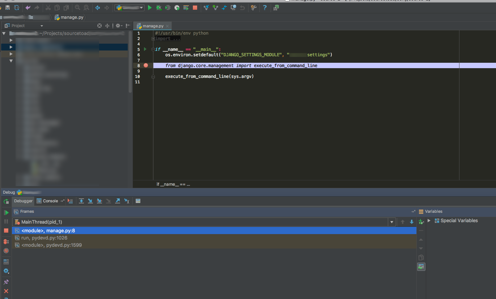