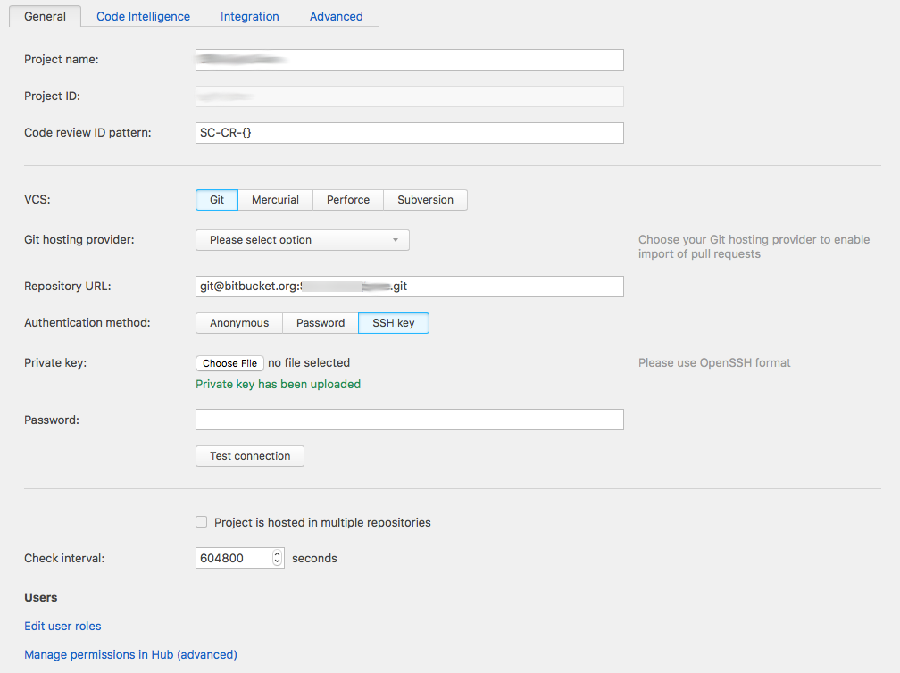
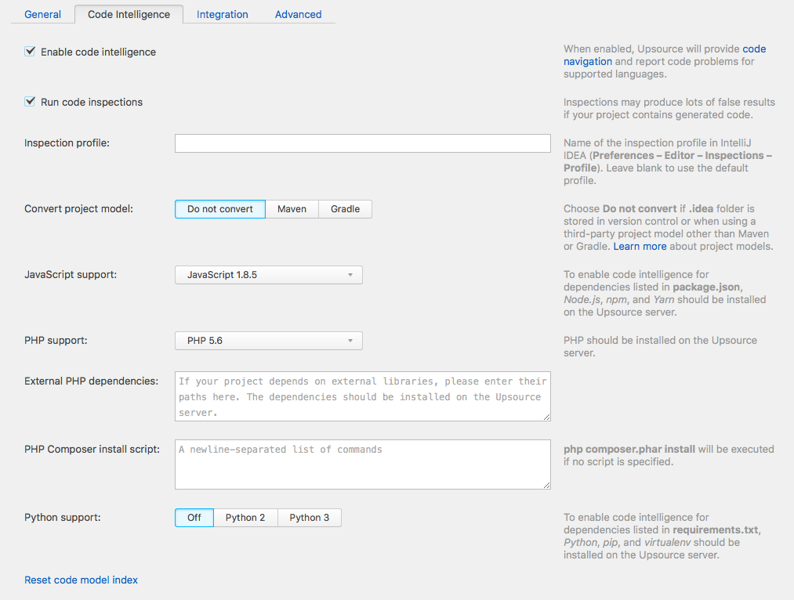
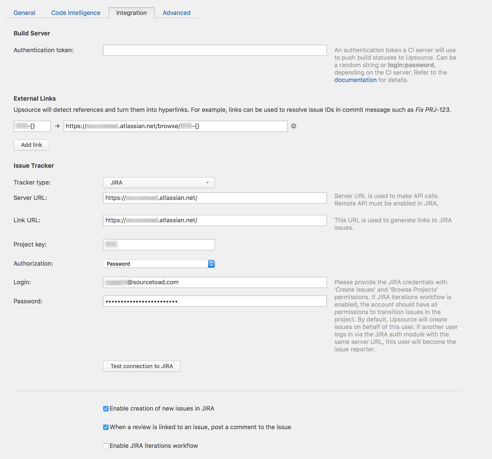
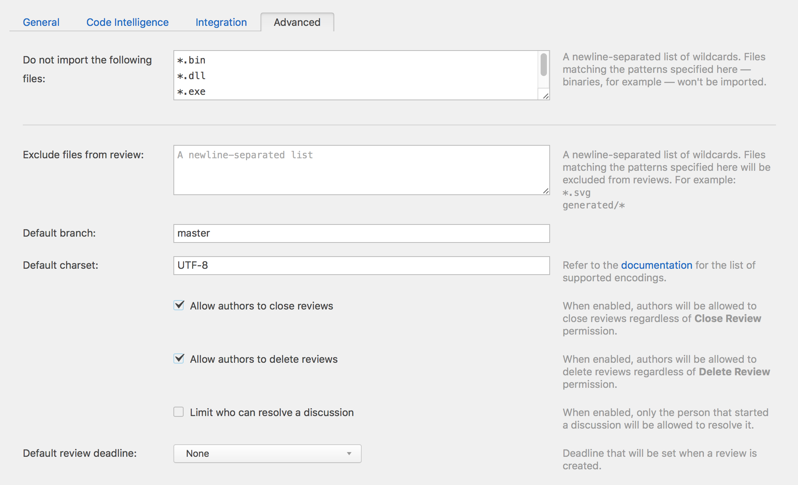

# Creating New project
Hit `Create project` on the project administration page. If you do not have access to this page, let Garth know.

### General ###

Option | Value
------------- | -------------
Project name| Name of project
Project ID| will be generated from the project name, unless necessary do not change this.
Code review ID pattern| Will be generated from the project name, unless necessary do not change this.
VCS| Git
Git hosting provider| Can either be `Generic` or `Bitbucket Server`
Repository URL| url to repo
Authentication method| SSH Key - The ssh key can be found in password manager under `Upsource/Bitbucket/Jenkins Setup`
Check interval| 604800
Create user groups| true

**Note**
Before connecting a project to a private repo, you must add the necessary access key to that project. [Bitbucket access key](readme.md)

---

### Code Intelligence ###
if you wish to include Code Intelligence in your project, click on the checkbox and fill out the remaining fields as necessary.

---
### Integration ###
Integrate your project with Jenkins and JIRA. External Links is covered by the JIRA docs.

[Jenkins](JENKINS.md) | [JIRA](JIRA.md)

---
### Advanced ###
Controls several options for easier management of the project. Fill them out as necessary for each project.

