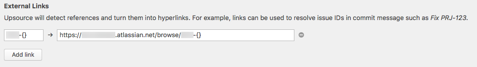
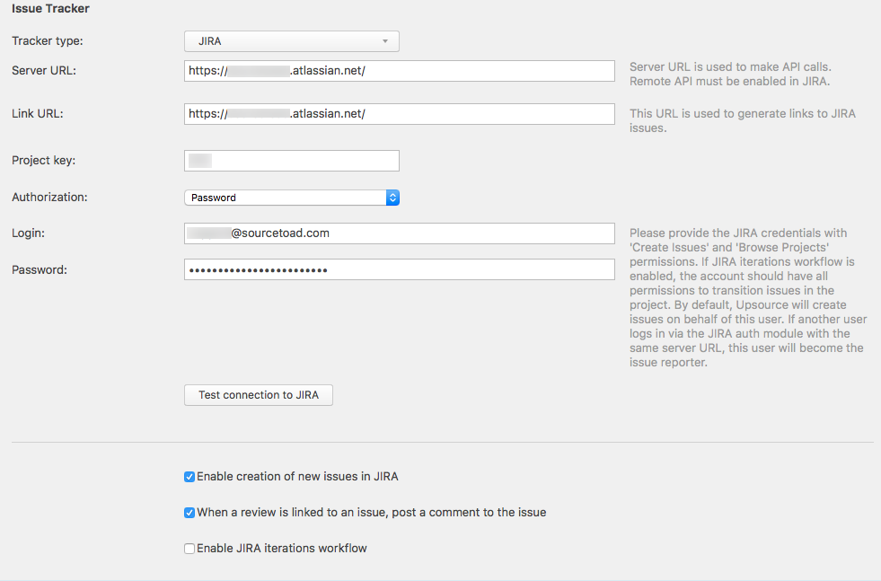

# JIRA Integration

### External Links

You should add an external link in order to link various strings to issues in JIRA.

Url is the path to your board, make sure to keep the `{}` so Upsource can perform the necessary regex.

### Issue Tracker

Fill out the issue tracker as indicated by the below picture. The password can be found in password manager under `Upsource/Bitbucket/Jenkins Setup`.

If your JIRA board is not on the Sourcetoad board. Please retrieve the url and an appropriate username/password for this to work. This user will have to have the necessary permission to manage the project in question.